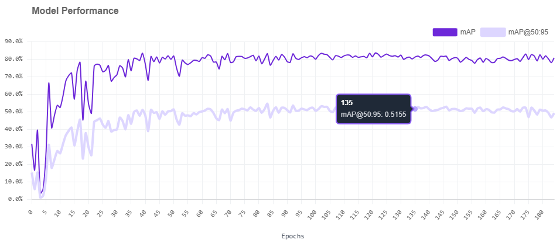
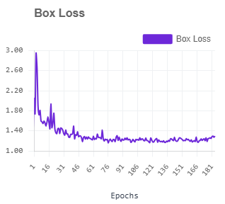
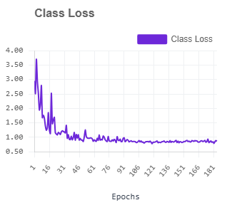
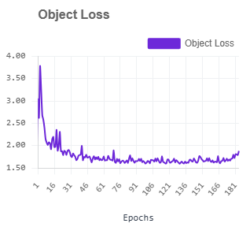

# Model Performance Report

## Training record

The model was trained on Roboflow as **YOLO11 Object Detection — Nano**, starting from an **MS COCO public checkpoint**. The project contains two classes: `crop` and `weed`.

Training was completed on the Roboflow platform in **17 minutes**. Local model training is not part of this deployment repository.

## Recorded metrics

| Metric | Value | Better direction |
|---|---:|---|
| mAP50 / AP50 | 83.1% | Higher |
| mAP50–95, visible chart point | 51.55% at epoch 135 | Higher |
| Precision | 75.9% | Higher |
| Recall | 80.2% | Higher |
| Derived F1 | 78.0% | Higher |
| Crop AP50 | 78% | Higher |
| Weed AP50 | 88% | Higher |
| Box loss, late training | About 1.2–1.3 | Lower |
| Class loss, late training | About 0.8–0.9 | Lower |
| Object loss, late training | About 1.6–1.8 | Lower |

The loss values above are approximate readings from the supplied graphs. They are not exported numeric experiment records.

## Chart interpretation

### Model performance

- X-axis: training epoch.
- Y-axis: percentage score.
- Dark purple: mAP50-style validation score.
- Light purple: stricter mAP50–95 score.
- Higher is better.
- The curves improve quickly and then plateau, which indicates convergence.
- The supplied tooltip shows mAP50–95 `0.5155` at epoch `135`.

### Box loss

Box loss measures bounding-box location error. It falls from roughly 2.9 to around 1.2–1.3. Lower is better.

### Class loss

Class loss measures crop-versus-weed classification error. It falls from roughly 3.7 to around 0.8–0.9. Lower is better.

### Object loss

Object loss measures whether the detector correctly recognizes object presence. It falls from roughly 3.8 to around 1.6–1.8. A small late increase suggests extra epochs were giving limited benefit.

## Which metric should select the best model?

Use **validation mAP50–95** as the primary checkpoint-comparison metric because it checks localization quality across several IoU thresholds. Then review:

1. weed recall;
2. crop precision;
3. crop-to-weed confusion;
4. weed-to-crop confusion;
5. latency.

Training loss alone should not select the model. A model can have low training loss but perform poorly on new images.

## Missing evidence

The current Roboflow plan did not export:

- exact final mAP50–95 summary;
- per-class precision and recall;
- confusion matrix;
- untouched independent test-set report;
- exact training hyperparameters;
- exact selected checkpoint epoch.

These values must not be invented.
