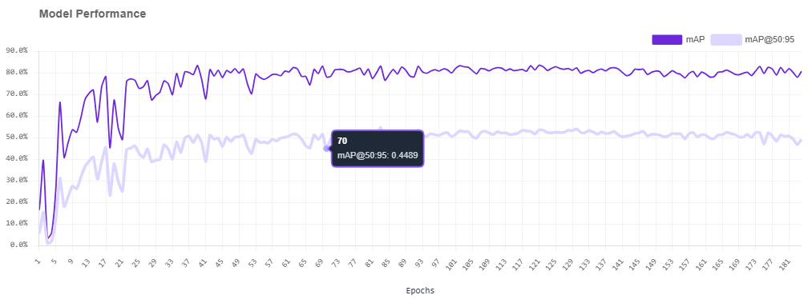
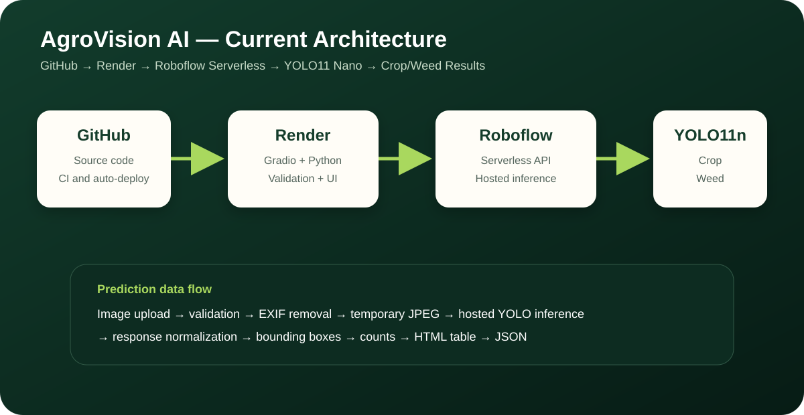

# AgroVision AI — Crop and Weed Detection

AgroVision AI is a complete portfolio-ready object-detection application for identifying **crops** and **weeds** in agricultural images. It uses a YOLO11 Nano model trained and hosted on Roboflow, a secure Python backend, and a responsive Gradio interface that runs locally or on Hugging Face Spaces.

> **Safety notice:** this is an educational/research demonstration. Do not use its predictions as the only decision signal for autonomous spraying, cutting, or crop removal.

## Project status

| Component | Status |
|---|---|
| YOLO11 Nano hosted model | Trained on Roboflow |
| Secure server-side API integration | Implemented |
| Image validation and metadata removal | Implemented |
| Gradio dashboard | Implemented |
| Annotated image, counts, table, JSON | Implemented |
| Automated tests without API calls | Implemented |
| GitHub CI and secret scan | Implemented |
| Hugging Face Space configuration | Implemented |
| Local `.pt` checkpoint | Not available / not required |
| Live provider verification in your account | Requires your newly rotated private key |

## Demo

The repository is configured as a Gradio Space. After following the deployment guide, Hugging Face creates the public/private app URL. The same application runs locally at `http://127.0.0.1:7860`.

## Screenshots and recorded evidence

The repository includes the actual Roboflow training-performance graph supplied for the trained model:



The live application screenshot should be added to the repository only after local or Hugging Face verification, so the README does not present a mock UI result as a measured deployment result.

## Features

- upload, webcam, and clipboard image input;
- configurable confidence and IoU thresholds;
- crop/weed bounding boxes and labels;
- crop count, weed count, average confidence, and latency;
- detection table and normalized JSON;
- bundled crop, weed, and mixed examples;
- EXIF/GPS metadata removal before cloud inference;
- environment-based secrets;
- lazy provider loading so the UI can start without a key;
- test suite that does not spend Roboflow credits;
- configurable in-memory burst limiting to reduce accidental public API usage;
- Docker, GitHub Actions, and Hugging Face deployment files;
- implementation, study, viva, and presentation documentation.

## Problem statement

Agricultural fields contain crops, weeds, shadows, soil, overlap, blur, and changing plant appearances. The system must localize multiple plants and classify them correctly. Two errors are especially important:

- a missed weed reduces recall;
- a crop classified as weed can be harmful in automated treatment systems.

## Architecture



```text
Field image
   ↓
Image validation + orientation + metadata removal
   ↓
Gradio/Python backend
   ↓
Roboflow Serverless Cloud API
   ↓
Private YOLO11 Nano model
   ↓
Class/box normalization
   ↓
Annotated image + counts + table + JSON
```

The private Roboflow key is read only by the server process. It is never embedded in JavaScript or returned in output.

## Model

| Item | Value |
|---|---|
| Task | Object detection |
| Architecture | YOLO11 Nano |
| Initialization | MS COCO public checkpoint |
| Classes | `crop`, `weed` |
| Model ID | `crop-or-weed-detection-jnmzz-1-yolo11n-t1/1` |
| Training | Roboflow-managed |
| Inference | Roboflow Serverless Cloud API |

### Recorded Roboflow validation results

| Metric | Value |
|---|---:|
| mAP50/AP50 | 83.1% |
| Precision | 75.9% |
| Recall | 80.2% |
| Crop AP50 | 78.0% |
| Weed AP50 | 88.0% |
| Derived aggregate F1 | ~78.0% |
| Exact mAP50–95 | Not exported |
| Per-class precision/recall | Not exported |
| Confusion matrix | Not exported |
| Independent untouched test | Not established |

These are Roboflow validation values, not a claim of production performance on every farm. See [MODEL_REPORT.md](MODEL_REPORT.md) and [MODEL_CARD.md](MODEL_CARD.md).

## Technology stack

- Python 3.11
- Gradio 6.5.1
- Roboflow Inference SDK 1.3.9
- Pillow 12.3.0
- python-dotenv
- Pytest
- Docker
- GitHub Actions
- Hugging Face Spaces

## Project structure

```text
agrovision-ai/
├── app.py
├── README.md
├── START_HERE.md
├── MODEL_CARD.md
├── MODEL_REPORT.md
├── QA_REPORT.md
├── PROJECT_MANIFEST.md
├── requirements.txt
├── requirements-dev.txt
├── pyproject.toml
├── .env.example
├── Dockerfile
├── docker-compose.yml
├── src/agrovision/
│   ├── config.py
│   ├── errors.py
│   ├── schemas.py
│   ├── image_utils.py
│   ├── rate_limit.py
│   ├── roboflow.py
│   ├── visualization.py
│   ├── service.py
│   └── ui.py
├── tests/
├── scripts/
├── examples/
├── assets/
├── docs/
├── deploy/
└── .github/workflows/
```

See [PROJECT_MANIFEST.md](PROJECT_MANIFEST.md) for every file and its responsibility.

## Security step before running

A Roboflow private key appeared in an earlier screenshot. Treat any key that has appeared in chat or an image as compromised:

1. revoke/roll it in Roboflow;
2. generate a new private key;
3. never send or screenshot the new value;
4. store it only in `.env` locally and a Hugging Face Secret in production.

## Local installation — Windows

```powershell
cd C:\data\agrovision-ai

py -3.11 -m venv .venv
.\.venv\Scripts\Activate.ps1

python -m pip install --upgrade pip
pip install -r requirements-dev.txt

Copy-Item .env.example .env
notepad .env
```

Add only your new private key:

```env
ROBOFLOW_API_KEY=YOUR_NEW_PRIVATE_KEY
```

Verify and run:

```powershell
python scripts\preflight.py --require-key
python scripts\check_secrets.py
pytest
python scripts\smoke_test.py
python scripts\live_inference_test.py
# Optional; consumes multiple provider requests:
python scripts\benchmark_latency.py --runs 5 --warmup 1
python app.py
```

Open `http://127.0.0.1:7860`.

## Local installation — Linux/macOS

```bash
python3.11 -m venv .venv
source .venv/bin/activate
python -m pip install --upgrade pip
pip install -r requirements-dev.txt
cp .env.example .env
# Edit .env and add the new private key.
python scripts/preflight.py --require-key
pytest
python scripts/live_inference_test.py
python app.py
```

## Usage

1. Upload a field image or select an example.
2. Start with confidence `0.50` and IoU `0.50`.
3. Click **Analyze field image**.
4. Review boxes, crop/weed counts, confidence, latency, table, and JSON.
5. Lower confidence carefully when weeds are missed; raise it when false detections dominate.

## Testing

```bash
python -m compileall -q app.py src scripts tests
python scripts/check_secrets.py
pytest
python scripts/smoke_test.py
```

The verified build suite contains configuration, image-validation, parser, service, and Gradio tests. Provider calls are mocked/faked in automated tests.

## API usage

The Gradio event is exposed as `/predict`. After deployment, use the Space's **Use via API** panel or see [docs/16_API_USAGE.md](docs/16_API_USAGE.md).

## Docker

```bash
cp .env.example .env
# Add the private key to .env.
docker compose up --build
```

## GitHub setup

```bash
git init
git add .
git commit -m "Initial production-ready AgroVision AI project"
git branch -M main
git remote add origin https://github.com/YOUR_USERNAME/agrovision-ai.git
git push -u origin main
```

Run `python scripts/check_secrets.py` before every public push.

## Hugging Face deployment

> **Current account note:** Hugging Face Space eligibility and hardware rules can change. Check the **Create new Space** page for your account. This app needs only a Python/Gradio runtime because YOLO inference runs on Roboflow.

1. Create a new **Gradio Space**.
2. Push/upload this repository.
3. Open **Settings → Variables and secrets**.
4. Add `ROBOFLOW_API_KEY` as a **Secret**.
5. Wait for the build.
6. Run an included example and review the logs/output.

See [docs/08_HUGGING_FACE_DEPLOYMENT.md](docs/08_HUGGING_FACE_DEPLOYMENT.md) for the complete procedure.

## Performance parameters

Monitor:

- request round-trip latency and cold starts;
- Roboflow credits/quota and error rate;
- confidence/IoU operating point;
- input file size and pixel count;
- concurrent users, queue length, and rate-limit rejections;
- no-detection rate and false positives;
- crop-as-weed and weed-as-crop errors on labeled evaluation data.

## Example results

### Normal case

**Input:** clear field image containing a plant similar to training data.  
**Expected behavior:** one or more boxes, class/confidence values, counts, table, and JSON. Exact values depend on live inference.

### Edge case

**Input:** blur, overlap, shadow, small plants, or background vegetation.  
**Expected behavior:** the app still returns a valid response, but confidence/detection quality may decrease.

### Invalid case

**Input:** no image or an oversized/corrupt image.  
**Expected behavior:** a user-friendly validation error; no provider request.

## Limitations

- internet, valid credentials, and Roboflow quota are required;
- weights cannot currently be downloaded;
- exact mAP50–95 and confusion matrix are unavailable;
- validation split may contain near-duplicate/label-quality issues;
- broad crop/weed classes do not identify species;
- performance on unseen farms is not proven;
- this is not a safety-certified agricultural control system.

## Future improvements

- clean labels and construct leakage-safe grouped splits;
- export full test predictions and confusion matrices;
- optimize class-aware thresholds;
- compare YOLO11n/s/m and RF-DETR under identical conditions;
- add difficult field examples and independent farm/session testing;
- add monitoring and usage limits;
- support a verified local/edge checkpoint when weights become available.

## Documentation

Start with [START_HERE.md](START_HERE.md), then read the numbered documents in [`docs/`](docs/). They include setup, implementation, evaluation, troubleshooting, study notes, 35 viva questions, a 12-slide presentation outline, and an exact end-to-end deployment runbook. See [QA_REPORT.md](QA_REPORT.md) for what was and was not executed.

## License

MIT License. Dataset and Roboflow model usage remain subject to their original terms.

## Author

**Vaibhav Admane**
