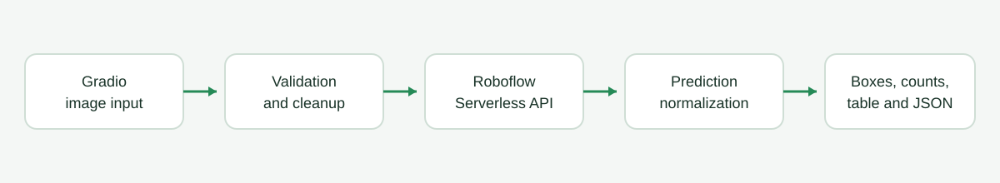

# AgroVision AI - Crop and Weed Detection

[](https://github.com/Vaibhav-153/agrovision-ai/actions/workflows/ci.yml)

AgroVision AI is a Python web application for detecting and localizing crops and weeds in field images. The interface is built with Gradio and sends sanitized images to a YOLO11 Nano model hosted through the Roboflow Serverless API.

The project focuses on the inference and deployment side of the workflow. A local trained checkpoint and the training dataset are not included in this repository.

## What it does

- accepts an uploaded image, webcam capture, or clipboard image;
- validates image dimensions and removes EXIF metadata before inference;
- sends the sanitized image to the hosted Roboflow model;
- converts provider predictions into a consistent internal format;
- draws crop and weed bounding boxes on the image;
- shows class counts, confidence values, coordinates, and request latency;
- exposes the Gradio prediction endpoint as `/predict`;
- keeps the Roboflow API key on the server;
- applies a small in-memory request limit for the public demo.



## Model

| Item | Value |
|---|---|
| Task | Object detection |
| Model | YOLO11 Nano |
| Classes | `crop`, `weed` |
| Training | Transfer learning from an MS COCO pretrained checkpoint |
| Training platform | Roboflow |
| Hosted model ID | `vaibhav-admane/crop-or-weed-detection-jnmzz-1-yolo11n-t1` |

Recorded project metrics are mAP50 83.1%, precision 75.9%, recall 80.2%, crop AP50 78%, and weed AP50 88%. These are training-platform values recorded with the project; they were not reproduced in this repository because the training dataset and local checkpoint are not included.

See [docs/MODEL_CARD.md](docs/MODEL_CARD.md) for model details and [docs/DATASET.md](docs/DATASET.md) for the dataset information that is currently available.

## Project structure

```text
agrovision-ai/
|-- .github/workflows/ci.yml
|-- assets/
|   |-- architecture.svg
|   `-- custom.css
|-- docs/
|   |-- DATASET.md
|   `-- MODEL_CARD.md
|-- scripts/
|-- src/agrovision/
|-- tests/
|-- .env.example
|-- app.py
|-- pyproject.toml
|-- render.yaml
|-- requirements-dev.txt
`-- requirements.txt
```

## Local setup

Python 3.11 or 3.12 is recommended.

### Windows PowerShell

```powershell
py -3.11 -m venv .venv
.\.venv\Scripts\Activate.ps1
python -m pip install --upgrade pip
pip install -r requirements-dev.txt
Copy-Item .env.example .env
```

### Linux or macOS

```bash
python3.11 -m venv .venv
source .venv/bin/activate
python -m pip install --upgrade pip
pip install -r requirements-dev.txt
cp .env.example .env
```

Add your private Roboflow key to `.env`:

```text
ROBOFLOW_API_KEY=YOUR_PRIVATE_KEY
```

Run the checks:

```bash
python scripts/preflight.py --require-key
python scripts/check_secrets.py
ruff check .
python -m pytest -q
python scripts/smoke_test.py
```

Start the app:

```bash
python app.py
```

Then open `http://127.0.0.1:7860`.

## Live inference test

The live test uses real Roboflow credits and requires an image path:

```bash
python scripts/live_inference_test.py path/to/field-image.jpg
```

For repeated latency measurements:

```bash
python scripts/benchmark_latency.py path/to/field-image.jpg --runs 5
```

## Render deployment

`render.yaml` contains the web-service configuration. The required secret is:

```text
ROBOFLOW_API_KEY
```

The normal model and limit settings are included in the blueprint. Deployment availability is not treated as a permanent repository status because it depends on Render service state, Roboflow credentials, network access, and provider credits.

## Tests

The test suite covers configuration, input validation, rate limiting, Roboflow response parsing, service output, visualization, helper functions, and Gradio UI construction. Offline tests use a fake hosted model and do not consume Roboflow credits.

```bash
python -m pytest -q
```

## Limitations

- The training dataset is not included and its original source/license are not recorded in the repository.
- The local trained checkpoint is not available.
- Exact training hyperparameters were not exported from the training platform.
- Performance on unseen farms, crops, seasons, cameras, and lighting conditions has not been established.
- The in-memory rate limiter is process-local and is intended only for a small demo.

This is an educational project. Do not use its output as the only decision signal for autonomous spraying, cutting, crop removal, or other safety-critical agricultural control.

## License

MIT License. See [LICENSE](LICENSE).

## Author

Vaibhav Admane
